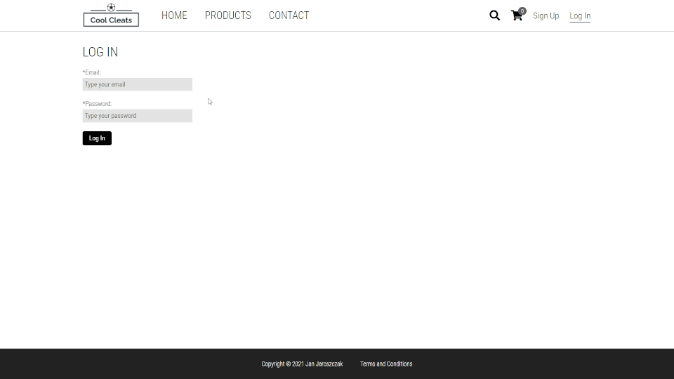
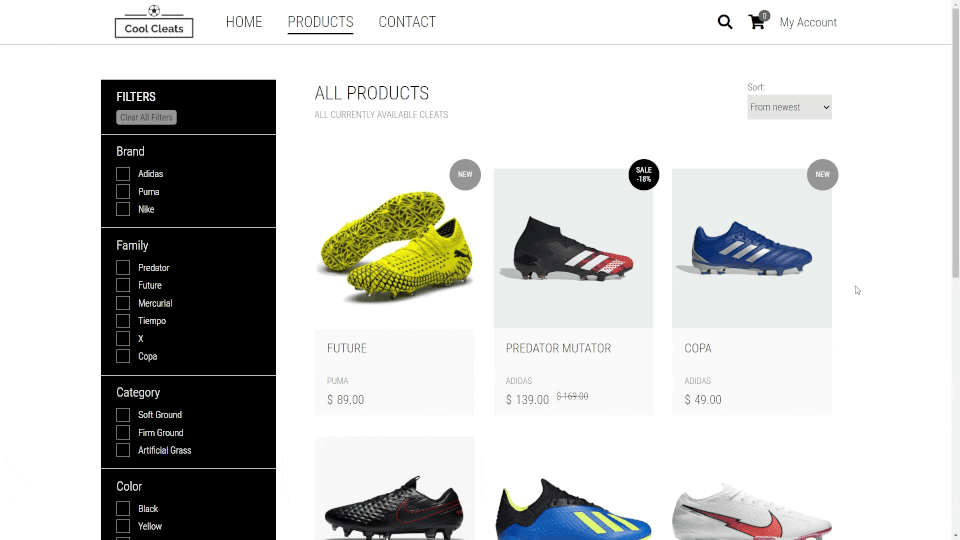
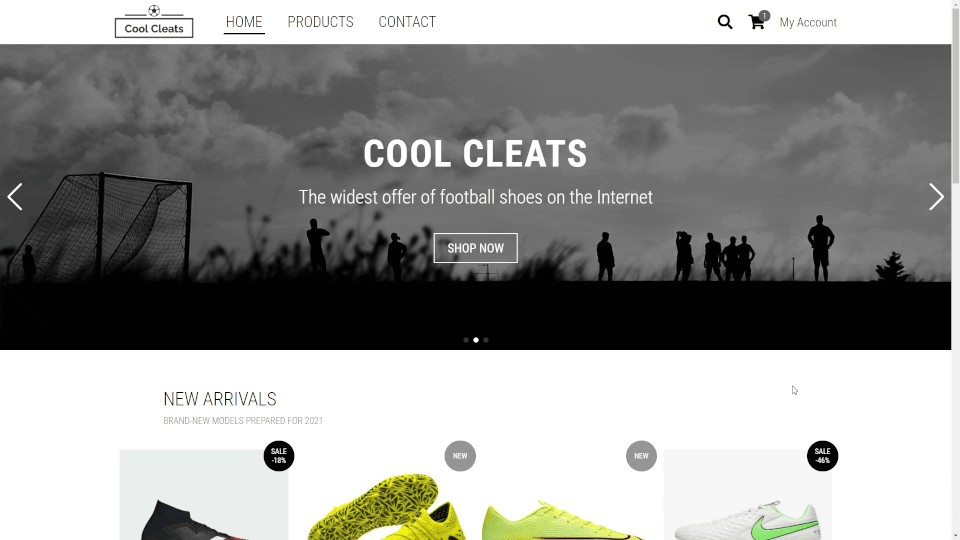
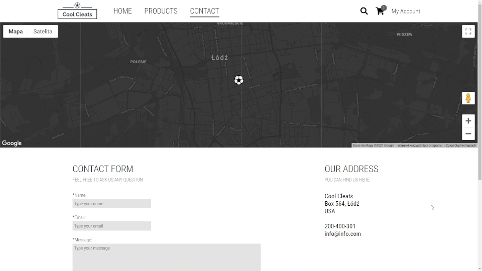
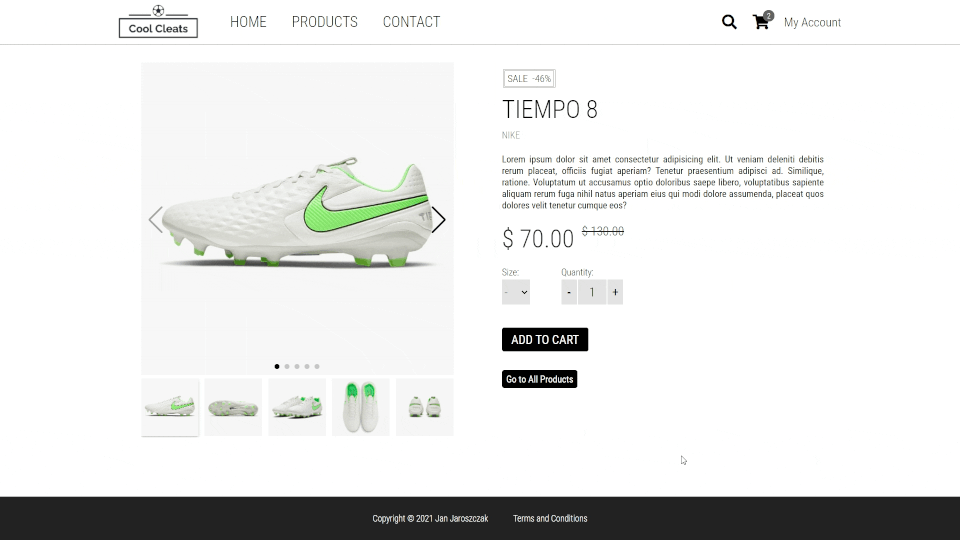
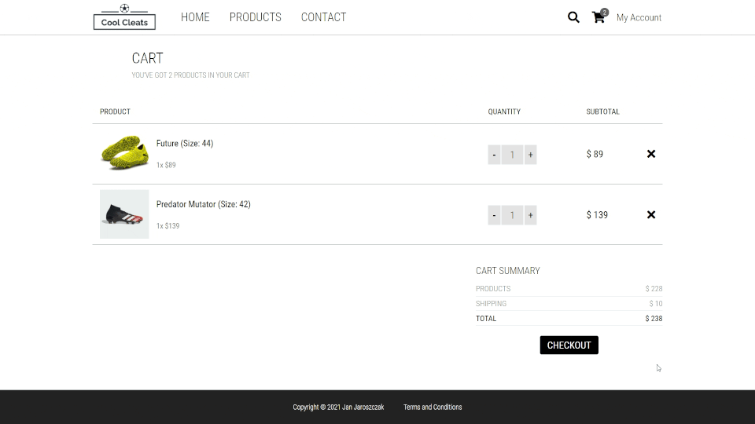
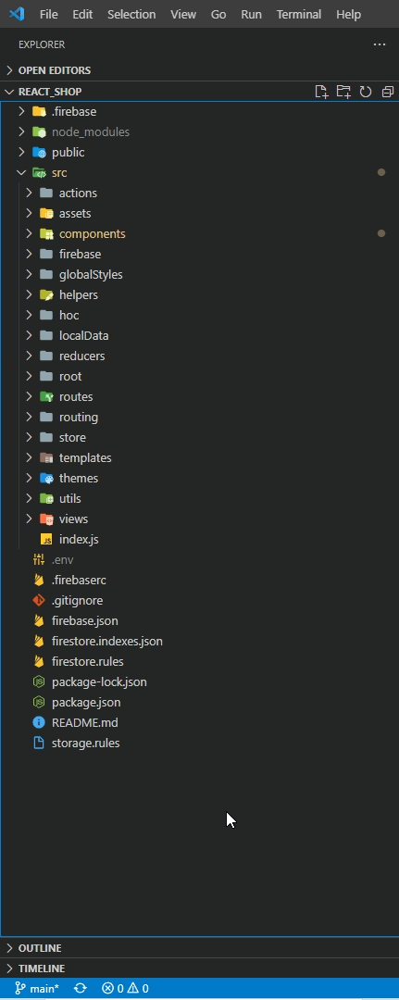

# Online Shop

An online shop with football shoes. Users can register, edit accounts, use contact form, search products, edit cart and submit payments. The website has a fully responsive design – from 280px foldable mobiles to desktops.

### Live version is available [here](https://coolcleats.com/).

<br/>

Desktop version:


<br/>

Mobile version:


<br/>

## Table of Contents

1. Setup
2. Technologies
3. Features
4. What next
5. Contact

<br/>

## 1. Setup

- Check if you have node.js and npm installed. To do it, run this command in your terminal:

```npm
node -v
```

- If you don't have node, go to nodejs.org and install it on your local machine.

- Clone the project repository to your local machine.

- Check, if you have ‘node modules’ folder in your project structure. If you don't have it, run:

```npm
npm install
```

- Once you have ‘node modules’, run:

```npm
npm start
```

- The browser will automatically open the project on ‘localhost:3000’.

<br/>

## 2. Technologies

The following technologies were used in the project:

- HTML
- CSS
- JavaScript
- React
- Redux
- React Router
- Google Firebase
- Formik
- Yup
- EmailJS
- Material-UI
- Swiper
- Styled Components
- Responsive Web Design
- Atomic Design

  <br/>

## 3. Features

Below, a list of most important features of the project.

- Users can create an account which stores orders history, contact data and provides possibility to edit them as well as changing password and account email. User data is stored in Firestore database.



<br/>

- Products data is stored in Google Firestore database. Products can be filtered and sorted depending on user’s preferences. On product page, users may choose a size, add the product to the cart and browse through product gallery created with Swiper.



<br/>

- A fully functional products search function is implemented – created with an own code and a displayed in a form of a custom popper. Users can operate the popper with both mouse and keyboard.



<br/>

- Great majority of the layout was created with custom Styled Components. Header, product cards swiper and photo galleries were created with Swiper and modals with Material-UI.


<br/>

- Contact page has a custom Google Map implemented to fit the color palette of the project. Users can also use a contact form to send a message to page owner. Contact form backend is managed by EmailJS.



<br/>

- The website offers an editable cart. After adding a product to cart, a modal with the cart content is displayed. Users can open cart details page product quantity can be edited or a product can be fully removed from the cart. Once cart check is done, users may proceed to checkout.



<br/>

- Having proceeded to checkout users are asked to fill in their data. After filling it in, users will be asked if they want to save the added date on their account. If users had already their data saved on the account earlier, the form will be pulled automatically from the database while opening the checkout page. Having the data filled and terms and conditions accepted, users can go to payment which is implemented with a use of Paypal sandbox.



<br/>

- Files structure is organised basing on Atomic Design.



<br/>

- The project has a fully responsive design – from 280px foldable mobiles to desktops.

<br/>
